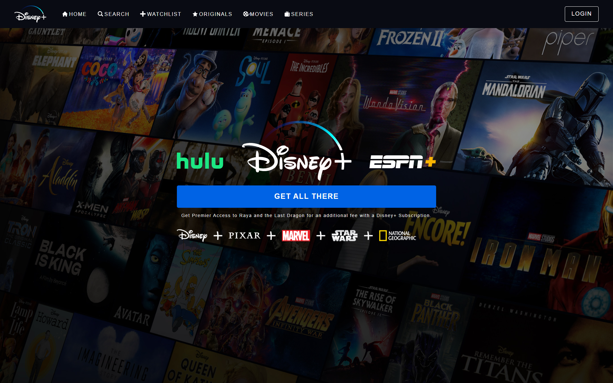

# Disney+ Clone

## Running Locally
Execute the following commands in the terminal:

1. Install the dependencies: `yarn`

2. Start the local server: `yarn start`

## Packages Used:
1. React Router DOM: Helps in routing between pages (routes) such as home, search, etc.
2. React Styled Components: Custom Component naming with styles specified in a single file instead of a separate CSS file.

## Preview

### Live Site:
> https://faisalsaifii.github.io/disney-clone/